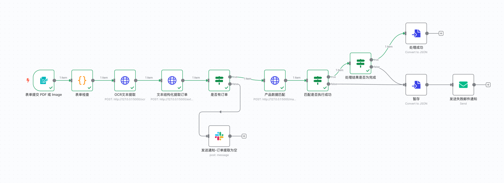

# Invoice Agent n8n工作流设计

本文档详细描述了如何在n8n中实现Invoice Agent系统的自动化工作流，利用集成微服务进行OCR处理、LLM提取和产品匹配。

## 工作流概述



工作流程包含以下主要阶段：
1. 表单提交 PDF 或 Image - 接收上传的发票文件
2. 表单检查 - 验证上传的文件格式和内容
3. OCR文本提取 - 从文件中提取文本内容
4. 文本结构化提取订单 - 从OCR文本中提取结构化订单信息
5. 是否有订单 - 检查是否成功提取到订单数据
6. 产品数据匹配 - 将提取的产品与系统数据进行匹配
7. 匹配结果验证 - 检查匹配是否成功执行
8. 结果处理 - 根据状态执行不同操作（处理成功或失败）

## 工作流节点详细配置

### 1. 表单提交 PDF 或 Image

**节点名称**: 表单提交 PDF 或 Image

**配置**:
- **类型**: n8n 表单

**实施细节**:
- 在n8n中创建此节点后，会生成一个URL如：`http://127.0.0.1:5678/form-test/dff1f557-6eda-43cf-8de1-95fc7d8fca24`
- 在此页面上进行表单提交
- 确保表单包含文件上传字段支持PDF和图像格式

### 2. 表单检查

**节点名称**: 表单检查

**配置**:
- **类型**: Code 节点
- **操作**: 验证提交的文件格式和内容

**代码**:
```javascript
const item     = $input.first();
const formData = item.json;
const binary   = item.binary || {};

const fileKeys = Object
  .keys(binary)
  .filter(k => k.startsWith('file_') || k === 'file');

if (fileKeys.length === 0) {
  throw new Error('未找到任何上传文件');
}

const customerName = formData.customer_name || '';

const files = fileKeys.map(key => {
  const f = binary[key];
  return {
    fileName   : f.fileName || 'unknown',
    mimeType   : f.mimeType,
    base64Data : f.data,
  };
});

return [
  {
    json: {
      customerName,
      files,                 // ← 包含所有文件的数组
      timestamp: new Date().toISOString(),
    }
  }
];
```

### 3. OCR文本提取

**节点名称**: OCR文本提取

**配置**:
- **类型**: HTTP Request节点
- **方法**: POST
- **URL**: `http://127.0.0.1:5000/ocr`
- **请求格式**: JSON
- **请求体**:
```json
{
  "files": "{{$json.files}}",
  "customer_name": "{{$json.customerName}}"
}
```

**实施细节**:
- 调用OCR微服务的API进行文本识别
- 发送base64编码的文件数据
- 接收包含OCR识别文本的响应

### 4. 文本结构化提取订单

**节点名称**: 文本结构化提取订单

**配置**:
- **类型**: HTTP Request节点
- **方法**: POST
- **URL**: `http://127.0.0.1:5000/extract`
- **请求格式**: JSON
- **请求体**:
```json
{
  "text": "{{$json.text}}",
  "customer_name": "{{ $('表单检查').item.json.customerName }}",
  "task_id": "{{ $json.task_id }}"
}
```

**实施细节**:
- 调用文本处理微服务，从OCR文本中提取结构化订单信息
- 发送OCR文本和客户信息
- 接收包含结构化订单数据的响应

### 5. 是否有订单

**节点名称**: 是否有订单

**配置**:
- **类型**: IF节点
- **条件**: `{{ $json.success }} == true && {{ $json.order_data.items }} > 0`

**实施细节**:
- 检查文本处理微服务是否成功提取到订单数据
- 成功则继续处理，失败则发送通知

### 5.1 发送通知-订单提取为空

**节点名称**: 发送通知-订单提取为空

**配置**:
- **类型**: Slack节点
- **频道**: `#invoice-notifications`
- **内容**: 
```
无法从以下文件提取订单信息: 
文件名: {{ $('表单提交 PDF 或 Image').item.json.file }} 
时间: {{$node["表单检查"].json.timestamp}} 
原因: {{$node["文本结构化提取订单"].json.error || "未能识别订单数据"}}  

请手动检查此文件。
```

### 6. 产品数据匹配

**节点名称**: 产品数据匹配

**配置**:
- **类型**: HTTP Request节点
- **方法**: POST
- **URL**: `http://127.0.0.1:5000/match`
- **请求格式**: JSON
- **请求体**:
```json
{
  "order_data": {{$node["文本结构化提取订单"].json.order_data}},
  "threshold": 0.6,
  "task_id": "{{$node["文本结构化提取订单"].json.task_id }}"
}
```

**实施细节**:
- 调用产品匹配微服务，将提取的订单与产品数据库进行匹配
- 设置匹配阈值为0.6（可根据需要调整）
- 接收包含匹配结果的订单数据

### 7. 匹配是否执行成功

**节点名称**: 匹配是否执行成功

**配置**:
- **类型**: IF节点
- **条件**: `{{$json.success}} == true`

**实施细节**:
- 检查产品匹配过程是否成功完成
- 成功则继续处理，失败则发送失败通知

### 7.1 处理结果是否为完成

**节点名称**: 处理结果是否为完成

**配置**:
- **类型**: IF节点
- **条件**: `{{$json.order_data.status}} == "completed"`

**实施细节**:
- 检查订单匹配状态是否为"completed"
- 完成状态表示所有产品都成功匹配，无需人工审核

### 7.1.1 处理成功，订单 json 入库

**节点名称**: 处理成功，订单JSON入库

**配置**:
- **类型**: 转化为JSON

### 7.1.2 处理失败，发送失败邮件通知

**节点名称**: 处理失败，发送邮件通知

**配置**:
- **类型**: Send Email节点
- **收件人**: `[系统管理员邮箱]`
- **主题**: `订单处理需要人工审核: {{$node["表单检查"].json.fileName}}`
- **内容**: 
```html
<h2>订单需要人工审核</h2>
<p><strong>文件名:</strong> {{ $('表单提交 PDF 或 Image').item.json.file}}</p>
<p><strong>客户:</strong> {{$node["表单检查"].json.customerName || "未提供"}}</p>
<p><strong>日期:</strong> {{$node["产品数据匹配"].json.order_data.order_date || "未识别"}}</p>

<h3>需要审核的产品:</h3>
<ul>
{{#each $node["产品数据匹配"].json.order_data.items}}
  {{#if this.needs_review}}
  <li style="color: red;">
    原文本: {{this.original_input}} → 匹配: {{this.matched_name || "未匹配"}} 
    (匹配分数: {{Math.round(this.match_score * 100)}}%, 数量: {{this.quantity}})
  </li>
  {{/if}}
{{/each}}
</ul>

<p>请登录系统进行人工审核。</p>
```

### 7.2 发送失败邮件通知

**节点名称**: 发送失败邮件通知

**配置**:
- **类型**: Send Email节点
- **收件人**: `[系统管理员邮箱]`
- **主题**: `发票处理失败: {{$node["表单检查"].json.fileName}}`
- **内容**: 
```html
<h2>发票处理失败</h2>
<p><strong>文件名:</strong> {{$node["表单检查"].json.fileName}}</p>
<p><strong>错误信息:</strong> {{$node["产品数据匹配"].json.error || "产品匹配过程失败"}}</p>
<p><strong>时间戳:</strong> {{$node["表单检查"].json.timestamp}}</p>

<p>请检查微服务状态并重新处理此发票。</p>
```

## 微服务架构与API

整个工作流依赖于三个核心微服务API：

### 1. OCR服务 (`/ocr`)

**功能**:
- 接收PDF或图像文件
- 执行OCR识别
- 返回提取的文本

**请求格式**:
```json
{
  "base64": "BASE64_ENCODED_FILE",
  "file_type": "application/pdf"
}
```

**响应格式**:
```json
{
  "success": true,
  "text": "识别出的文本内容"
}
```

### 2. 文本提取服务 (`/extract`)

**功能**:
- 从OCR文本中提取结构化订单信息
- 使用LLM分析文本

**请求格式**:
```json
{
  "text": "OCR识别出的文本",
  "customer_name": "客户名称(可选)"
}
```

**响应格式**:
```json
{
  "success": true,
  "order_data": {
    "customer_name": "客户名称",
    "order_date": "2023-05-12",
    "items": [
      {
        "original_input": "产品原始描述",
        "quantity": 2
      }
    ],
    "total": 299.99,
    "currency": "CNY"
  }
}
```

### 3. 产品匹配服务 (`/match`)

**功能**:
- 将提取的产品与数据库产品进行匹配
- 计算匹配分数
- 确定订单状态

**请求格式**:
```json
{
  "order_data": {
    // 从提取服务获取的订单数据
  },
  "threshold": 0.7
}
```

**响应格式**:
```json
{
  "success": true,
  "order_data": {
    "customer_name": "客户名称",
    "order_date": "2023-05-12",
    "status": "completed", // 或 "needs_review"
    "items": [
      {
        "original_input": "产品原始描述",
        "matched_name": "标准产品名称",
        "product_id": "SKU123",
        "quantity": 2,
        "match_score": 0.95,
        "needs_review": false
      }
    ],
    "total": 299.99,
    "currency": "CNY"
  }
}
```

## 部署与测试

### 部署前检查清单

1. **环境准备**:
   - n8n已安装并运行
   - OCR、提取和匹配微服务已部署并能访问
   - 已配置必要的API密钥和认证信息

2. **文件配置**:
   - 确保产品数据库文件已正确设置
   - 配置邮件发送服务
   - 设置Slack通知（如果使用）

3. **连接测试**:
   - 测试各个微服务API是否正常响应
   - 验证n8n能够访问所有服务

### 测试步骤

1. **端到端测试**:
   - 准备测试发票文件（PDF和图像格式）
   - 通过触发表单提交发送测试文件
   - 检查工作流执行情况和最终结果

2. **节点测试**:
   - 使用n8n的"执行此节点"功能单独测试每个节点
   - 验证每个条件分支的执行路径

3. **异常处理测试**:
   - 测试无效文件格式
   - 测试OCR识别失败的情况
   - 测试无法提取订单数据的情况
   - 测试产品匹配失败的情况

## 优化建议

1. **性能优化**:
   - 增加微服务的并发处理能力
   - 为OCR处理添加缓存机制
   - 定期清理临时文件

2. **功能增强**:
   - 添加历史订单查询功能
   - 实现订单状态跟踪和更新
   - 增加批量处理能力

3. **安全增强**:
   - 为所有API添加认证
   - 添加输入验证和参数检查
   - 实现敏感数据加密保存 